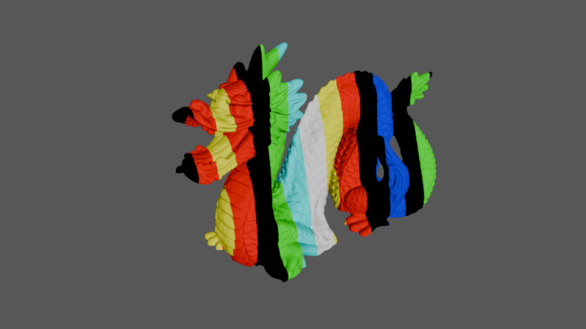
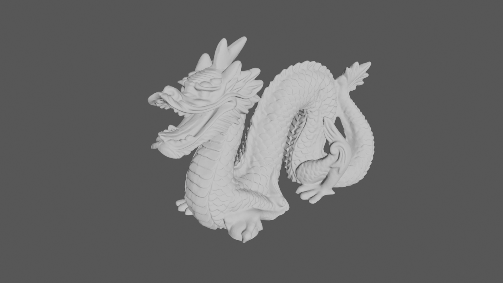
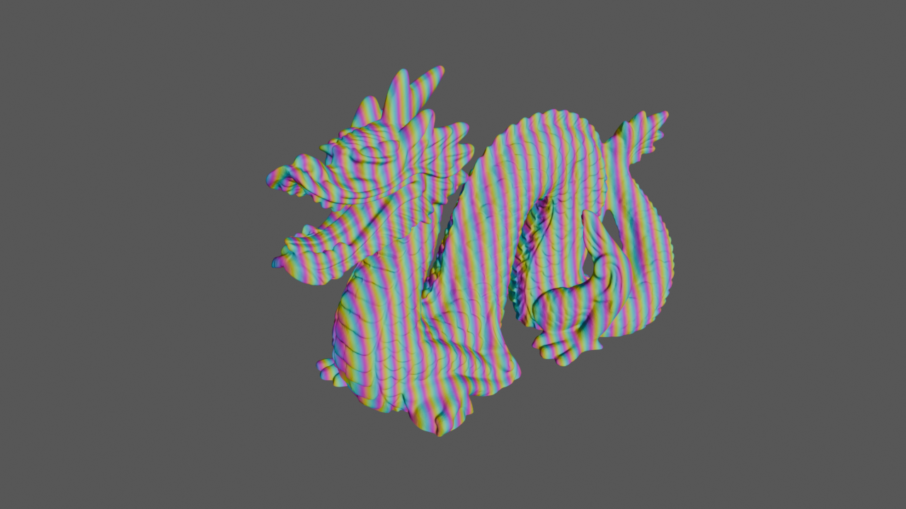
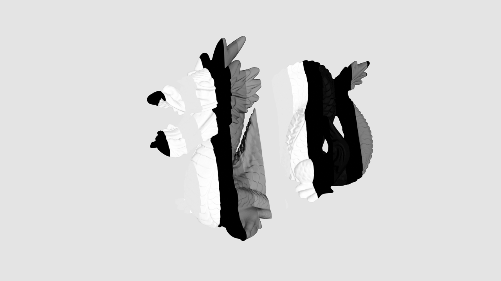
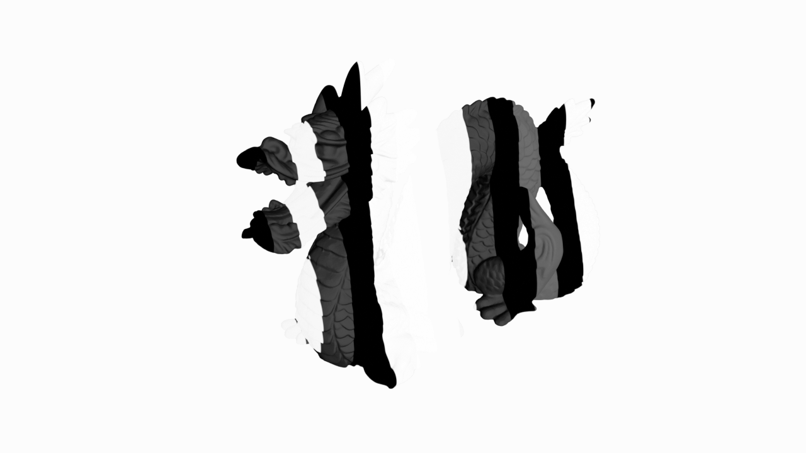
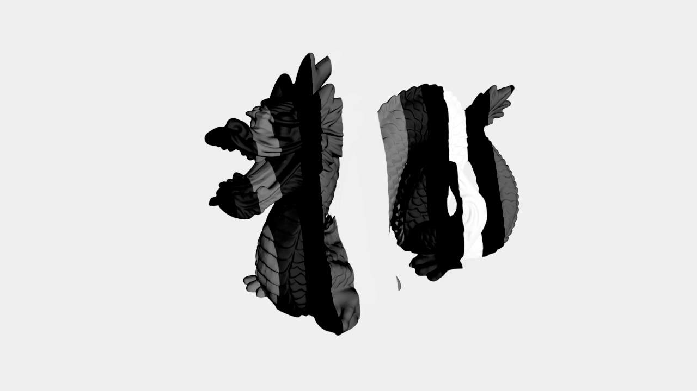
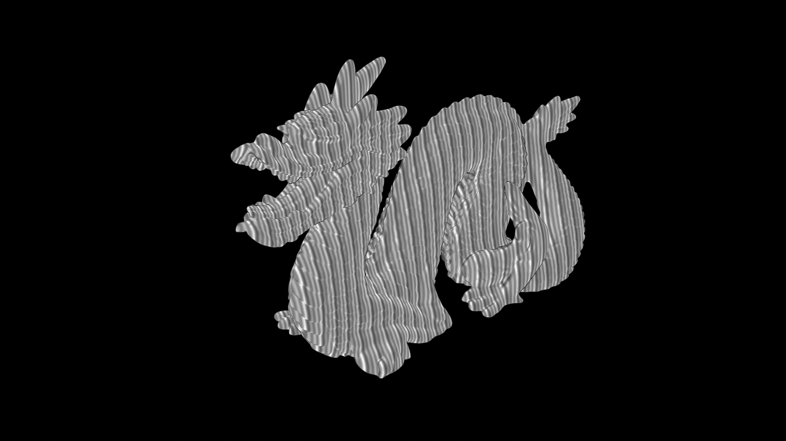
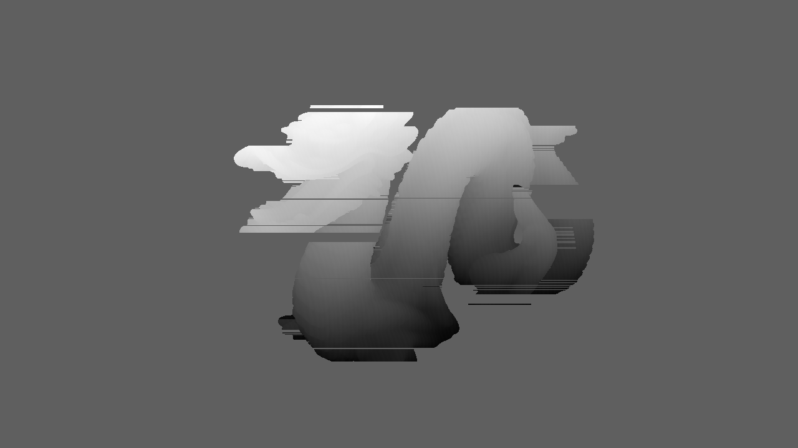

# Color-Coded Stripe + RGB Phase 3D 복원

`src/StructuredLight/Core/ColorCoded.h` / `.cpp` 에 구현된, **컬러 스트라이프 코드 +
RGB 3-step 위상** 기반 3D 복원 파이프라인 설명서. `python/ColorCoded.py` 를 Eigen
기반 C++로 포팅한 것이다.

예제 실행 파일: `example/ColorCodedTest.cpp` (`./build/ColorCodedTest dataset`)

---

## 1. 알고리즘 개요

`MultiFrequencyPhaseShift`(Gray code + 다중 주파수 위상)와 목표는 동일하다 —
각 카메라 픽셀이 "프로젝터의 어느 x 좌표(`uProjector ∈ [0,1)`)에 대응하는가"를
알아내고, 카메라 레이 ∩ 프로젝터 평면 삼각측량으로 3D 점을 구한다. 다만 coarse
정보(Gray code)와 fine 정보(phase)를 얻는 방식이 다르다.

1. **Color Stripe Code (coarse)** — 화면을 RGB 컬러 팔레트로 구성된
   `codeLength`개의 스트라이프로 분할해 한 장의 패턴만으로 "대략 몇 번째
   스트라이프인가"를 알려준다 (`color_pattern_info.json`의 `sequence`/`palette`,
   여기서는 `mode: "hamming"`).
2. **RGB 3-step Phase (fine)** — R/G/B 세 채널에 120° 간격으로 위상을 인코딩한
   사인파 패턴 한 장으로 sub-pixel 정밀도의 wrapped phase를 얻는다
   (`color_phase_info.json`, `frequency = 64`).

Multi-Frequency 방식은 Gray code의 stripe 인덱스가 phase의 절대 주기(fringe
order)를 **결정적으로** 알려주지만, Color-Coded 방식은 한 장의 위상 패턴
(`frequency=64`)에 대해 컬러 코드 한 픽셀만으로는 64개의 fringe order 후보가
모호하게 남는다. 이를 해결하기 위해 **행(row) 단위 Viterbi-style DP**로
"컬러 코드 라벨 시퀀스"와 "위상 fraction 시퀀스"를 동시에 만족하는 fringe
order 경로를 복원한다.

```
color stripe capture ──▶ colorRatio ──▶ classifyColorCode ──▶ labels ──┐
                                                                          │
RGB phase capture ──▶ computePhase ──▶ wrappedPhase, modulation ────────┼──▶ decodeFringeOrder (Viterbi DP)
                                                                          │         │
                                                          phaseValid ────┘         ▼
                                                                          uProjector = (fringeOrder + fraction) / frequency
                                                                                     │
                                                                                     ▼
                                                               카메라 레이 ∩ 프로젝터 평면 삼각측량
```

DP는 한 행의 유효 phase 구간(`decodeFringeOrder`)마다 정방향/역방향으로 각각
수행되고(`bidirectionalConsensus`), 두 결과가 일치하는 픽셀만 최종적으로
유효한 fringe order로 채택한다. 또한 구간 내 컬러 라벨이 `colorInfo_.windowToStart`에
등록된 고유 윈도우와 충분히(`minAnchorWindows`) 매칭되어야 디코딩을 시도한다
(`countAnchorWindows`).

---

## 2. 입력 이미지

`example/ColorCodedTest.cpp`가 `dataset/`에서 읽어 `ColorCodedFrames`로 넘기는
카메라 캡처 이미지들이다. `MultiFrequencyPhaseShift`와 달리 컬러(`ImageVec3`,
R/G/B 각각 0~255 범위의 `Image`) 이미지를 사용한다.

### 2.1 컬러 스트라이프 코드 — `dataset/color/render_00.png`, `render_white.png`

| 컬러 스트라이프 코드 (`color`) | all-white 레퍼런스 (`white`) |
| --- | --- |
|  |  |

- `color`는 `color_pattern_info.json`의 `palette`(8색: 흑/적/녹/황/청/자/시안/백)와
  `sequence`(27개 스트라이프, Hamming 인접 코드)로 구성된 한 장의 컬러
  스트라이프 패턴이다.
- `white`는 색상 정규화(`computeColorRatio`)와 최종 포인트 클라우드의
  per-vertex 컬러로 사용된다.

### 2.2 RGB 3-step 위상 캡처 — `dataset/color_phase/render_00.png`



- R/G/B 채널이 각각 `phase_shifts_radians = {0, -120°, -240°}` 만큼 어긋난
  사인파 패턴(`frequency=64`)을 동시에 투사한 한 장의 캡처본이다.
- `computePhase()`가 아래 식으로 채널별 픽셀값에서 바로 wrapped phase /
  modulation을 계산한다(3-step PSP를 한 장의 컬러 이미지로 압축한 형태):

  ```
  wrapped     = atan2(√3·(G-B), 2R-G-B)      ∈ [0, 2π)
  modulation  = sqrt((2R-G-B)² + 3·(G-B)²) / 3
  ```

---

## 3. 파이프라인 단계별 디버그 이미지

`ColorCodedReconstruction::ExportDebugFile(outputDir)`를 호출하면 아래 중간
결과를 `outputDir/*.png` (8bit grayscale)로 저장한다. 아래 이미지들은
`dataset/` (1280x720) 실행 결과(`color_coded_debug/`)이다.

### 3.1 Color Ratio — `color_ratio_{r,g,b}.png`

```
colorRatio.ch = clamp(color.ch / max(white.ch, 1), 0, 1.25)
```

| R | G | B |
| --- | --- | --- |
|  |  |  |

- 조명 불균일(white 레퍼런스로 정규화)을 보정한 채널별 반사율 비율.
- `classifyColorCode`(hamming 모드: 임계값 `hammingOnThreshold`)와
  `emissionCost`(팔레트 색상과의 거리)에서 사용된다.

### 3.2 컬러 코드 라벨 — `labels.png`

```
bitR = colorRatio.R > hammingOnThreshold ? 1 : 0   (G, B도 동일)
label = bitR + 2·bitG + 4·bitB   ∈ [0, 7]
```


- 8단계 밝기 = 팔레트 인덱스(0=흑 ~ 7=백). `sequence`에 정의된 27개
  스트라이프가 이 라벨들의 시퀀스로 나타난다.
- `decodeFringeOrder`에서 `medianLabelKsize`로 1D median 필터링 후
  run-length encoding하여 `windowToStart`에 등록된 `decodeWindow`-길이
  시퀀스(앵커)를 찾는 데 사용된다.

### 3.3 Wrapped Phase / Modulation / Phase Valid

| wrapped phase | modulation | phase valid |
| --- | --- | --- |
|  |  |  |

- `wrapped_phase.png`: 0~255가 위상 0~2π에 선형 대응. `frequency=64`이므로
  화면을 가로지르는 톱니 줄무늬가 64개 나타난다.
- `modulation.png`: 신호 진폭. `phaseModulationThreshold`보다 작은 픽셀은
  `phase_valid`에서 제외된다.
- `phase_valid.png`: `modulation > phaseModulationThreshold` 마스크. 이
  마스크의 연속 구간(row 단위)이 `decodeFringeOrder`의 디코딩 대상 segment가
  된다 (`minSegmentPixels` 미만이면 스킵).

### 3.4 Fringe Order 디코딩 — `fringe_orders.png`, `fringe_valid.png`

| fringe orders | fringe valid |
| --- | --- |
|  |  |

- `decodeFringeOrder`가 각 row의 유효 phase 구간마다 Viterbi-style DP
  (`decodeSegment`)를 정방향/역방향으로 실행해 `frequency`(=64)개의 fringe
  order 상태 중 하나를 선택한다.
  - emission cost: 컬러 라벨/색상비율과 예상 스트라이프 색상의 차이
    (`emissionCost`).
  - smoothness: 인접 픽셀 간 예상 이동량(`expectedProjectorStepPx`)과의
    차이에 패널티(`smoothnessWeight`, `smoothnessTruncationPx`).
  - `localOrderJump`을 벗어나는 전이는 `discontinuityPenalty`로 처리.
- `fringe_orders.png`: 선택된 fringe order(0~63), 정규화되어 표시됨. 좌측에서
  우측으로 갈수록 밝아지는 64단 계단 형태가 정상이다.
- `fringe_valid.png`: `bidirectionalConsensus`가 켜진 경우 정방향/역방향 DP
  결과가 일치하는 픽셀만 흰색(255)으로 표시된다. `phase_valid.png`보다 좁아질
  수 있다(앵커 부족, 정/역방향 불일치 구간 제외).

### 3.5 정규화 Projector 좌표 — `uprojector.png`, `valid.png`

```
fraction    = wrapped / 2π
uProjector  = (fringeOrder + fraction) / frequency   ∈ [0, 1)
valid       = fringeValid && (0 <= uProjector < 1)
```

| uProjector | valid |
| --- | --- |
|  |  |

- `uprojector.png`는 `fringe_orders.png`의 64단 계단과 `wrapped_phase.png`의
  64개 톱니가 합쳐져, 화면 전체에 걸친 하나의 좌→우 그라디언트로 나타난다.
- `valid.png`는 최종 correspondence 유효성 마스크로, 객체 윤곽과 일치해야
  한다.

### 3.6 삼각측량 결과 — `depth.png`, `triangulation_valid.png`

`triangulate()`가 카메라 레이와 `uProjector`로 정의되는 프로젝터 평면의
교차점을 계산한다(교차각 `minTriangulationAngleDeg`, 거리 `t > 0`,
선택적으로 `maxCameraDistance` 검증).

| depth (world Z) | triangulation valid |
| --- | --- |
|  |  |

- `depth.png`는 유효 픽셀의 world Z 좌표를 정규화하여 표시한다(무효 픽셀은 0).
- `triangulation_valid.png`는 `valid.png`보다 더 좁아질 수 있다 (교차각이
  너무 작거나 `t <= 0`인 픽셀이 추가로 제외됨).

---

## 4. 설정 (`ColorCodedConfig`)

| 필드 | 기본값 | 설명 |
| --- | --- | --- |
| `phaseModulationThreshold` | 8.0 | `computePhase`의 modulation 최소값. 미달 시 위상 무효 |
| `hammingOnThreshold` | 0.80 | hamming 모드에서 채널 on/off 판정 임계값 (colorRatio 기준) |
| `minSegmentPixels` | 8 | fringe order 디코딩 대상이 되는 최소 연속 유효-phase 구간 길이 |
| `minRunPixels` | 3 | 앵커 윈도우 판정 시 run-length 최소 길이 |
| `minAnchorWindows` | 1 | 구간 디코딩에 필요한 최소 앵커(고유 윈도우 매칭) 수 |
| `medianLabelKsize` | 5 | 컬러 라벨 시퀀스의 1D median 필터 커널 |
| `localOrderJump` | 4 | DP에서 허용하는 fringe-order 점프 범위 |
| `expectedProjectorStepPx` | 1.0 | 픽셀당 기대 프로젝터 이동량 (smoothness 기준) |
| `smoothnessWeight` | 0.12 | smoothness 페널티 가중치 |
| `smoothnessTruncationPx` | 5.0 | smoothness 페널티 최대치(이 값 이상은 더 늘지 않음) |
| `discontinuityPenalty` | 7.0 | `localOrderJump`을 벗어난 전이에 부과되는 페널티 |
| `bidirectionalConsensus` | true | 정/역방향 DP 결과가 일치하는 픽셀만 유효로 채택 |
| `minTriangulationAngleDeg` | 0.25 | 레이-평면 최소 교차각 |
| `maxCameraDistance` | (없음) | 카메라로부터 최대 거리 (옵션) |

---

## 5. API 사용법

```cpp
#include "StructuredLight/Core/ColorCoded.h"

// color_pattern_info.json -> ColorCodeInfo
sl::ColorCodeInfo colorInfo = sl::ColorCodeInfo::create(
    sequence, palette /* 0..255 */, mode /* "hamming" */, selfEqualizing, decodeWindow);

// color_phase_info.json -> PhaseInfo
sl::PhaseInfo phaseInfo;
phaseInfo.frequency = 64;

sl::ColorCodedConfig config;

sl::ColorCodedReconstruction reconstructor(config, cameraCalibration, projectorCalibration,
                                            std::move(colorInfo), phaseInfo);

// frames.color/white/phase: ImageVec3 (R,G,B 0..255)
sl::ColorCodedResult result = reconstructor.run(frames);

// result.points / result.colors: 1:1 대응하는 유효 3D 점 + RGB 컬러

// 파이프라인 중간 결과를 PNG로 저장 (위 3장의 이미지들)
reconstructor.ExportDebugFile("color_coded_debug");
```

- `ExportDebugFile()`은 가장 최근에 호출한 `run()`(내부적으로
  `computeProjectorCoordinate()` + `triangulate()`)의 중간 결과를 기록한다.
- PNG 인코더(`detail::writeImagePNG` 등)는 `DebugImageExport.h/.cpp`에 공용으로
  구현되어 있으며 `MultiFrequencyPhaseShift`의 `ExportDebugFile()`과 동일한
  방식으로 동작한다.

---

## 6. Multi-Frequency Phase Shift와의 비교

| | Multi-Frequency Phase Shift | Color-Coded |
| --- | --- | --- |
| coarse 정보 | Gray code (`2^nGrayBits`개 패턴) | 컬러 스트라이프 (1개 패턴) |
| fine 정보 | 다중 주파수 4-step phase (`frequencies.size() * 4`개 패턴) | RGB 3-step phase (1개 패턴) |
| fringe order 결정 | Gray code 인덱스로 결정적(deterministic) | 행 단위 Viterbi DP로 컬러 코드 + smoothness 기반 추정 |
| 필요 패턴 수 | 많음 (정밀, 강건) | 적음 (빠른 캡처, 동적 장면에 유리) |
| 참고 문서 | [`docs/MultiFrequencyPhaseShift/README.md`](../MultiFrequencyPhaseShift/README.md) | (이 문서) |

두 방식 모두 최종적으로 `uProjector ∈ [0,1)` + `valid` 마스크를 만들어 동일한
"카메라 레이 ∩ 프로젝터 평면" 삼각측량 로직으로 3D 점을 얻는다는 점은 동일하다.
