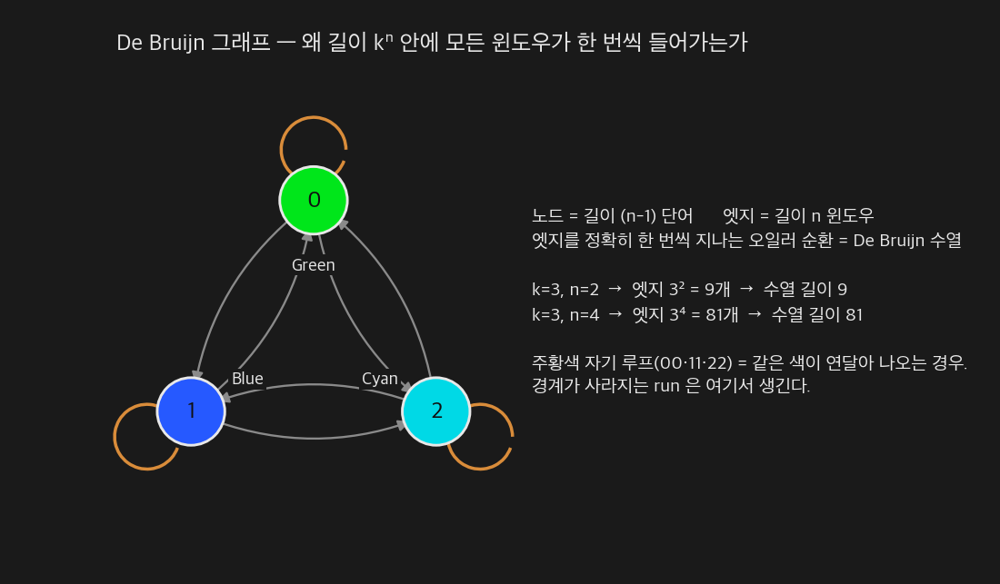
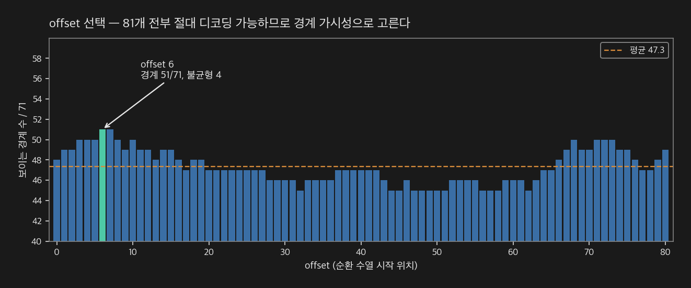
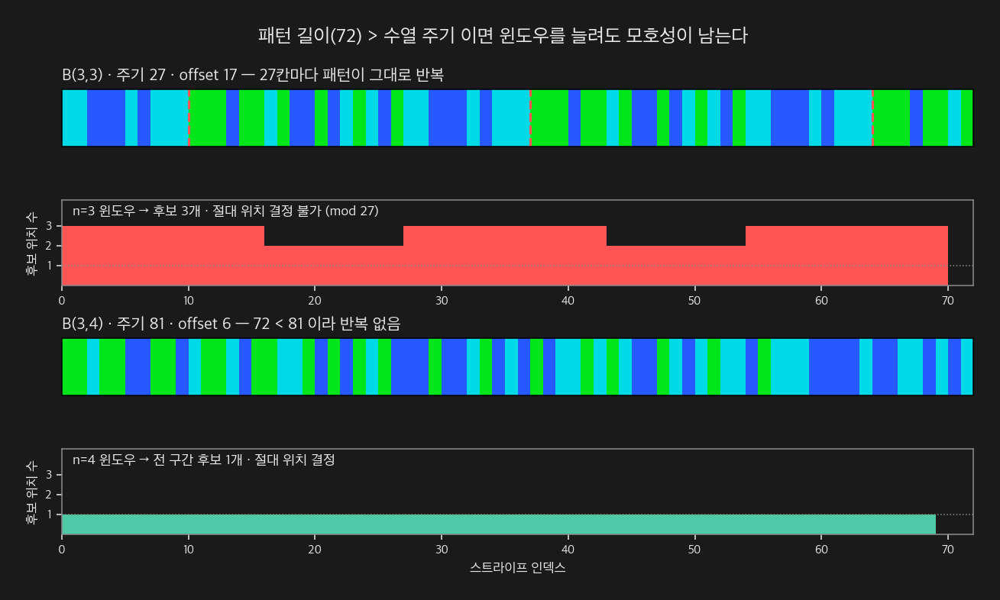
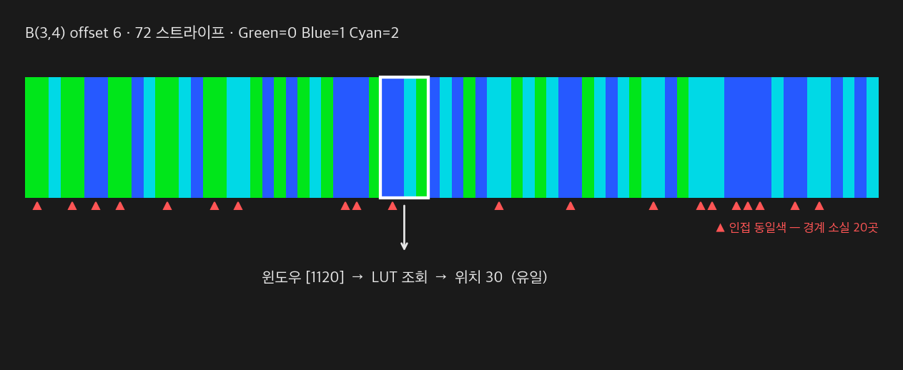
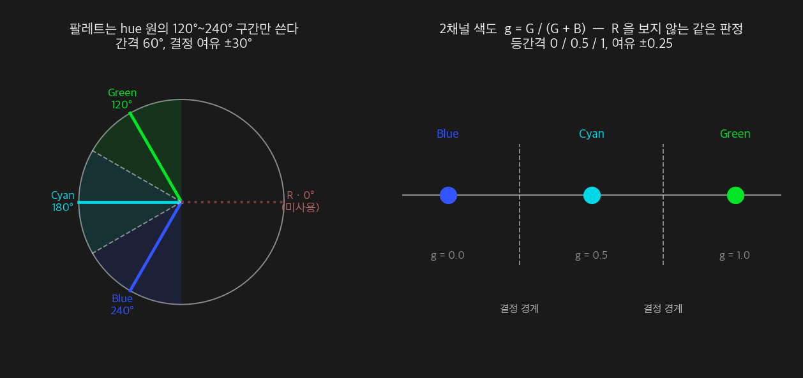
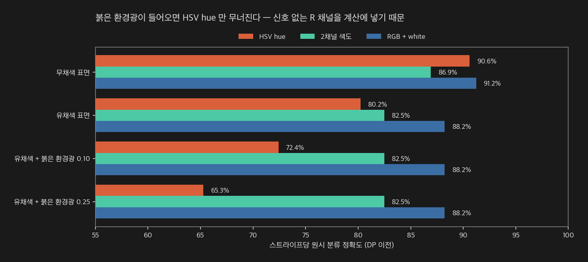
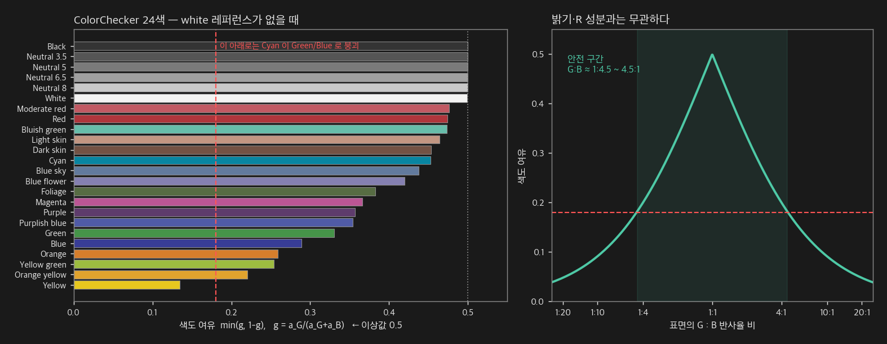
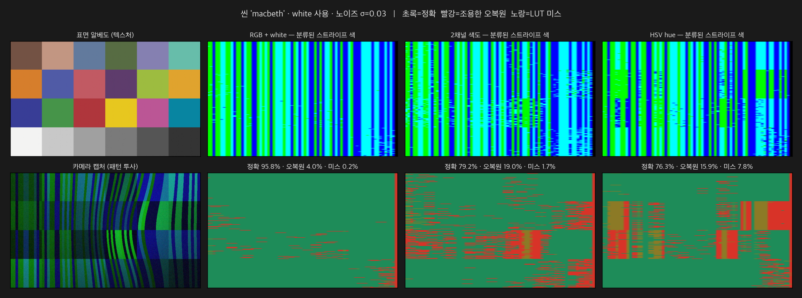
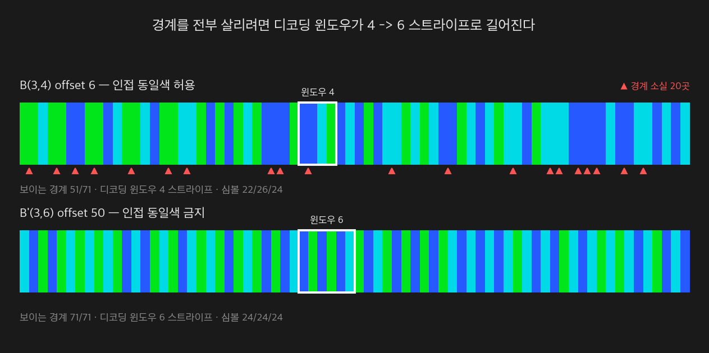

# De Bruijn 컬러 스트라이프 패턴 — 설계와 결정 과정

패턴 글라스 제작용 단일 촬영(single-shot) 컬러 스트라이프 패턴의 설계 문서.
생성기는 `python/DeBruijnPattern.py`, 설명 그림 생성기는 `python/DeBruijnFigures.py`.

`docs/ColorCoded/README.md` 가 설명하는 해밍 인접 코드 방식과 목적은 같고
(한 장의 패턴으로 프로젝터 x 좌표를 알아낸다), 코드 수열의 구성 원리가 다르다.

---

## 0. 결정된 스펙

| 항목 | 값 |
|---|---|
| 알파벳 | k = 3 — Green(0) / Blue(1) / Cyan(2) |
| 윈도우 길이 | n = 4 |
| 기본 수열 | De Bruijn B(3,4), 주기 81 |
| offset | 6 |
| 제작 길이 | 72 스트라이프 |
| SVG | 36 × 24 mm, 피치 0.5 mm (임시값) |
| 촬영 | 패턴 + **white 레퍼런스** 2장 |
| 색 분류 | RGB 최근접 (white 정규화 비율) |

```
기본 수열 B(3,4) · 주기 81
000010002001100120021002201010201110112012101220202110212022102221111211221212222

제작 코드 · offset 6 · 길이 72
002001100120021002201010201110112012101220202110212022102221111211221212
```

---

## 1. De Bruijn 컬러 패턴이란

### 1.1 풀려는 문제

구조광 3D 복원의 핵심은 **카메라 픽셀 ↔ 프로젝터 x 좌표 대응**을 찾는 것이다.
이 대응만 있으면 카메라 레이와 프로젝터 평면을 교차시켜 3D 점이 나온다.

Gray code나 위상 이동(phase shift)은 패턴을 여러 장 투사해 시간축으로 이 대응을
인코딩한다. 정확하지만 촬영 중에 물체가 움직이면 안 된다.

**단일 촬영**은 그 정보를 한 장의 공간 배치에 전부 넣어야 한다. 컬러 스트라이프
방식은 화면을 세로 스트라이프로 나누고 각 스트라이프에 색을 부여해서,
**연속된 몇 개의 색 나열이 곧 그 위치의 주소**가 되게 만든다.

문제는 이렇다 — 카메라는 물체에 가린 일부 구간만 볼 수 있다. 그러니
"어느 구간을 잘라 봐도 그 색 나열이 패턴 전체에서 유일해야" 한다.
이 조건을 **윈도우 유일성(window uniqueness)** 이라고 한다.

### 1.2 De Bruijn 수열

k개 심볼로 이루어진 수열 중, **길이 n인 모든 부분열이 정확히 한 번씩** 나타나는
순환 수열을 De Bruijn 수열 B(k, n) 이라 한다. 길이는 정확히 kⁿ 이다.



원리는 그래프로 보면 명확하다. 노드를 길이 (n−1) 단어, 엣지를 길이 n 윈도우로 두면
모든 노드의 입·출차수가 k로 같아져 **오일러 순환**이 존재한다. 엣지를 정확히
한 번씩 지나는 경로가 곧 De Bruijn 수열이고, 엣지 수 kⁿ 이 수열 길이가 된다.

이게 왜 좋은가 — kⁿ 길이 안에 가능한 모든 윈도우가 **낭비 없이 정확히 한 번씩**
들어간다. 즉 주어진 색 개수와 윈도우 길이에서 이론적 최대 길이의 패턴이다.

### 1.3 색을 심볼로

심볼 하나를 색 하나에 대응시키고, 수열을 세로 스트라이프로 그리면 컬러 패턴이 된다.
디코더는 이렇게 동작한다:

```
캡처 영상 ──▶ 스트라이프 분할 ──▶ 색 분류 ──▶ 심볼 시퀀스
                                                    │
                                       연속 n개를 잘라 윈도우 LUT 조회
                                                    │
                                                    ▼
                                     절대 스트라이프 인덱스 (= 프로젝터 x)
                                                    │
                                                    ▼
                                  카메라 레이 ∩ 프로젝터 평면 삼각측량
```

이 저장소의 `ColorCoded` 파이프라인에서는 이 인덱스가 위상(phase)의 fringe order를
고정하는 coarse 정보 역할을 하고, sub-pixel 정밀도는 위상이 담당한다.

---

## 2. 파라미터 결정 방법

설계 변수는 네 개다 — **L**(스트라이프 수), **k**(색 수), **n**(윈도우 길이),
**offset**. 결정 순서가 중요하다. 뒤 단계가 앞 단계의 제약을 받기 때문이다.

### 2.1 L — 스트라이프 수

측정 시야, 원하는 가로 해상도, 광학계가 분해 가능한 최소 선폭에서 정해진다.
설계의 입력이지 선택지가 아니다. 이번 건은 **L = 72**로 주어졌다.

### 2.2 k — 색 개수

많을수록 짧은 윈도우로 긴 패턴을 만들 수 있지만, 색 사이 거리가 좁아져 오분류가
늘어난다. 실무에서는 채널이 완전히 켜지거나 꺼진 조합만 쓴다 —
같은 채널에서 중간 밝기를 구분하려 들면 표면 반사율에 그대로 휘둘린다.

이번 패턴은 **Green / Blue / Cyan** 3색이다. 즉 **R 채널을 쓰지 않는다.**
합리적인 선택이다:

- 대부분의 실물 표면(피부, 목재, 붉은 계열 도장)이 R을 강하게 반사해 색 비율을 왜곡한다
- 베이어 CFA에서 R↔G 크로스토크가 크다
- 색수차가 R에서 가장 심해 스트라이프 경계가 흐려진다

대가는 알파벳이 작아진 만큼 **윈도우를 길게 잡아야 한다**는 것이다.

### 2.3 n — 윈도우 길이

여기가 핵심이다. 길이 L 패턴에서 잘라낼 수 있는 길이 n 윈도우는 **L − n + 1개**다.
이게 전부 서로 달라야 하므로:

```
L − n + 1  ≤  kⁿ
```

k=3, L=72 에 대입하면:

| n | 필요 윈도우 수 (72−n+1) | 가용 윈도우 수 (3ⁿ) | 판정 |
|---|---|---|---|
| 3 | 70 | 27 | **불가** |
| 4 | 69 | 81 | **가능** |
| 5 | 68 | 243 | 가능 (과잉) |

**n = 4가 최소값**이다 (`DeBruijnPattern::minimumWindow()` 가 같은 계산을 한다). n을 키우면 여유는 생기지만 디코딩에 필요한 연속 관측
구간이 길어져서, 물체 경계나 가림(occlusion) 근처에서 복원이 끊긴다.
그래서 조건을 만족하는 **최소 n**을 쓴다.

> **인접 동일색을 금지하려면** 가용 윈도우가 k(k−1)ⁿ⁻¹ 로 줄어든다.
> k=3이면 n=5에서 48개, n=6에서 96개이므로 L=72에는 **n=6**이 필요하다.
> 경계 가시성과 윈도우 길이를 맞바꾸는 선택이며, 7절에서 따로 다룬다.

### 2.4 offset — 어디서 자를 것인가

수열 주기(81)가 제작 길이(72)보다 길면 **어디서 잘라도 된다**. 이 여유분이
공짜 최적화 자유도가 된다. 81개 후보를 전부 평가해서 골랐다.



평가 기준은 **보이는 경계 수**다. 같은 색이 연달아 나오면 그 사이 경계는 물리적으로
사라지고, 경계는 sub-pixel 위치 추정의 유일한 단서이므로 많을수록 좋다.
81개 offset의 경계 수는 45~51 범위에 평균 47.3으로 분포한다.

최댓값 51은 offset 6과 7 두 곳에서 나왔고, 심볼 사용 균형이 더 나은
**offset 6**(22/26/24, 불균형 4)을 선택했다. offset 7은 불균형이 5다.

### 2.5 결정 순서 요약

```
L (시야 · 광학 분해능에서 주어짐)
  │
  ├─▶ k  (카메라 색 분리 능력, 표면 색 영향 → 채널 on/off 조합만)
  │
  ├─▶ n  = min{ n : L − n + 1 ≤ kⁿ }        ← 유일성을 만족하는 최소값
  │
  ├─▶ offset  = argmax(보이는 경계 수)        ← kⁿ > L 일 때만 생기는 자유도
  │
  └─▶ 피치  (광학 분해능, 회절 한계, 카메라 픽셀당 스트라이프 폭)
```

---

## 3. 이번 패턴의 결정 과정

### 3.1 초기 스펙과 그 문제

처음 검토한 것은 **B(3,3)** — 주기 27, offset 17에서 72개를 잘라내는 안이었다.
그런데 주기 27짜리 수열을 72까지 늘리려면 **반복**할 수밖에 없다.



패턴이 27칸마다 그대로 반복되므로, 어떤 윈도우든 **72 안에서 최대 3번** 나타난다.
중요한 건 이게 **n을 키워도 해결되지 않는다**는 점이다:

| n | 윈도우 수 | 서로 다른 값 | 최대 중복 |
|---|---|---|---|
| 3 | 70 | 27 | 3 |
| 4 | 69 | 27 | 3 |
| 5 | 68 | 27 | 3 |
| 7 | 66 | 27 | 3 |

주기가 반복되면 윈도우도 함께 반복되기 때문이다. 위치는 **mod 27** 로만 결정된다.

두 가지 선택지가 있었다:

- **A. 그대로 두고 기하로 푼다** — 시차(disparity) 탐색 범위가 27 스트라이프 미만이면
  세 후보 중 하나만 유효 심도 안에 들어와 모호성이 해소된다. 주기 패턴인 위상 이동이
  동작하는 것과 같은 원리다. 측정 심도 범위가 좁을 때 유효하다.
- **B. 주기를 늘린다** — B(3,4)는 주기가 81이라 72를 반복 없이 덮는다.

**B를 선택했다.** 글라스는 다시 만들 수 없고, 심도 범위 가정에 복원 성공 여부를
거는 것보다 패턴 자체가 절대 좌표를 담는 편이 안전하다.

### 3.2 B(3,3) → B(3,4) 비교

| | B(3,3) offset 17 | **B(3,4) offset 6** |
|---|---|---|
| 주기 | 27 (72까지 2.7회 반복) | 81 (반복 없음) |
| 절대 디코딩 | 불가 — mod 27, 최대 3중 | **가능 — 69개 윈도우 전부 유일** |
| 디코딩 윈도우 | 3 스트라이프 | 4 스트라이프 |
| 보이는 경계 | 45 / 71 (63%) | **51 / 71 (72%)** |
| run 길이 분포 | 1:29, 2:8, **3:9** | 1:36, 2:13, 3:2, **4:1** |
| 심볼 균형 | 24 / 23 / 25 | 22 / 26 / 24 |

윈도우가 3→4로 늘어나는 것이 유일한 비용이다. 경계는 오히려 6개 늘고 긴 run은
9개에서 3개로 줄었다. 대신 길이 4짜리 run이 하나 생기는데(`1111`), 완전 De Bruijn
수열은 `kkkk` 형태를 반드시 포함하므로 피할 수 없다.

### 3.3 최종 패턴



---

## 4. 검증

산출물에서 **거꾸로 읽어** 확인했다. 생성 코드가 맞다고 주장하는 것과 실제 파일이
그 값을 담고 있는 것은 다른 문제이기 때문이다.

| 검사 | 방법 | 결과 |
|---|---|---|
| PNG 왕복 | 스트라이프 중심 픽셀 → 최근접 팔레트 색 → 심볼 | 의도 코드와 완전 일치 |
| SVG 왕복 | rect 폭·색 파싱 → 심볼 복원 | 일치, 간극·중첩 없음, 총폭 36 mm, stripe rect 52개 |
| 윈도우 유일성 | 69개 4-윈도우 LUT 구성 | 중복 0개 |
| 위치 복원 | 모든 위치 i에서 윈도우 조회 → i 복원 | 전 구간 성공 |

---

## 5. 색 분류 — HSV를 써야 하는가

스트라이프를 위치로 바꾸려면 먼저 각 스트라이프의 색을 3개 라벨 중 하나로 판정해야
한다. 이 단계가 무너지면 뒤의 윈도우 조회도 삼각측량도 의미가 없다.

"조도 변화에 강하려면 HSV를 써라"는 조언이 흔한데, **이 팔레트에서는 절반만 맞다.**
방향은 옳지만 정통 HSV hue는 오히려 손해다.

### 5.1 위상 쪽은 이미 hue를 쓰고 있다

저장소에서 색을 다루는 곳은 두 군데이고, 한 곳은 이미 hue 기반이다.

| 단계 | 현재 방식 | HSV 적용 여지 |
|---|---|---|
| RGB 3-step **위상** 복원 | `atan2(√3(G−B), 2R−G−B)` | **이미 hue 각 그 자체** — 손댈 것 없음 |
| 컬러 스트라이프 **분류** | 채널별 임계 또는 RGB 최근접 | 여기가 논점 |

`ColorCoded.cpp` 의 위상 공식은 RGB를 0°/120°/240°에 놓고 색 벡터 합의 각도를
구하는 것, 즉 hue다. 위상 패턴은 R·G·B 세 채널을 모두 쓰므로 이 선택이 정확하다.
논점은 `classifyColorCode()` 쪽이다.

### 5.2 R을 안 쓰는 팔레트에 HSV hue는 맞지 않는다

#### HSV hue 정의

정통 정의는 max/min 기반이다.

```
V = max(R, G, B)                          명도
C = V − min(R, G, B)                      chroma
S = C / V                                 채도

      ⎧ 60° · ((G − B)/C  mod 6)          V = R 일 때
H  =  ⎨ 60° · ((B − R)/C  +  2)           V = G 일 때
      ⎩ 60° · ((R − G)/C  +  4)           V = B 일 때
```

같은 각도를 **색 벡터 합**으로 쓰면 분기 없이 한 줄이 된다. RGB를 0°/120°/240°에
놓고 더한 벡터의 편각이다.

```
α  = R − (G + B)/2   =  (2R − G − B) / 2           실수부
β  = (√3 / 2)(G − B)                               허수부

H  = atan2(β, α)  =  atan2( √3(G − B),  2R − G − B )
C₂ = 2√(α² + β²) / 3        ← 저장소의 modulation 과 같은 값
```

`ColorCoded.cpp` 의 위상 공식이 바로 이 형태다. 위상 패턴은 R·G·B 세 채널을 모두
쓰므로 거기서는 정확한 선택이다.

#### 그런데 이 팔레트에서는 R이 순수한 잡음이다

**어느 형태든 R이 들어간다.** max/min 형태에서는 R이 max·min 판정에 참여하고,
atan2 형태에서는 실수부 α에 직접 들어간다. 그런데 Green/Blue/Cyan 팔레트의 R 채널에는
신호가 하나도 없다 — 노이즈와 환경광만 있다. hue를 쓰면 그 채널을 판정에 끌어들이게 된다.

대안은 R을 아예 보지 않는 **2채널 색도** `g = G / (G + B)` 다.

#### R = 0 일 때 둘은 같은 것이 된다

G + B > 0 이므로 `G − B = (G + B)(2g − 1)` 로 쓰면:

```
H = atan2( √3(G − B),  −(G + B) )
  = atan2( √3(G + B)(2g − 1),  −(G + B) )
  = atan2( √3(2g − 1),  −1 )              ← (G+B) 가 소거된다
```

H가 **g만의 함수**가 되고, g : 0 → 1 에 대해 H : 240° → 180° → 120° 로 단조 감소한다.
즉 이 팔레트에서 hue와 2채널 색도는 **같은 정보를 담고 있고**, hue 쪽만 α를 통해
R의 노이즈·환경광을 추가로 받는다. 5.3절의 붉은 환경광 실험이 그 차이를 그대로 보여준다.



| 색 | RGB | hue | g = G/(G+B) |
|---|---|---|---|
| Green | (0,1,0) | 120° | 1.00 |
| Cyan | (0,1,1) | 180° | 0.50 |
| Blue | (0,0,1) | 240° | 0.00 |

> **R을 버린 대가가 여기서도 나온다.** 세 색이 hue 원의 120°~240° 구간에만 몰려
> 간격이 60°, 결정 여유가 ±30°다. R을 쓰는 팔레트(R·G·B 또는 Y·C·M)라면 간격 120°,
> 여유 ±60°로 두 배가 된다. 2.2절의 표면 반사 문제와 맞바꾼 것이다.

### 5.3 시뮬레이션

72 스트라이프 한 행에 완만한 음영, 유채색 알베도 텍스처, 급격한 색 경계 한 곳,
베이어 누화, 8비트 양자화, σ = 0.03 가우시안 노이즈를 넣고 4000행씩 돌렸다
(`python/ColorClassifySim.py`).



| 조건 | HSV hue | 2채널 색도 | RGB + white |
|---|---|---|---|
| 무채색 표면 | 90.6% | 86.9% | **91.2%** |
| 유채색 표면 | 80.2% | 82.5% | **88.2%** |
| 유채색 + 붉은 환경광 0.10 | 72.4% | **82.5%** | **88.2%** |
| 유채색 + 붉은 환경광 0.25 | 65.3% | **82.5%** | **88.2%** |

붉은 환경광이 들어오는 순간 HSV hue만 무너진다 (90.6% → 65.3%). 2채널 색도는
값이 전혀 변하지 않는다 — R을 보지 않으니 붉은 환경광이 판정에 닿지 않는다.
백열등, 따뜻한 LED, 붉은 계열 물체의 상호반사 어디서나 생기는 조건이다.

> 위 수치는 **DP 이전의 원시 스트라이프 분류율**이지 최종 디코딩률이 아니다.
> `decodeSegment()` 의 양방향 Viterbi가 이웃 문맥으로 고립 오류를 상당 부분
> 복구하므로 최종 복원에서는 격차가 좁혀진다. 또한 가정한 누화·환경광·노이즈 모델
> 위의 합성 실험이므로, **절대 수치보다 방법 간 순위**가 결론이다.

### 5.4 결론 — white 레퍼런스를 함께 촬영한다 (확정)

표에서 보듯 **white 레퍼런스가 있으면 그것이 가장 좋다.** HSV도 색도도 필요 없다.

관측식을 보면 이유가 명확하다. 알베도가 수식상 **정확히 소거**된다.

```
관측  = 알베도 ⊙ 패턴색 × 음영
white = 알베도 ⊙ 1      × 음영
비율  = 관측 / white = 패턴색          ← 알베도·음영이 완전히 사라진다
```

**촬영 구성이 white 패턴을 함께 찍는 것으로 확정되었다.** 따라서:

| | 결정 |
|---|---|
| 분류기 | **RGB 최근접 (white 정규화 비율)** — 현재 파이프라인 유지 |
| HSV hue | **도입하지 않는다** — 이득이 없고 고노이즈에서 손해 |
| 2채널 색도 | 불필요 — white가 없을 때의 대안이었다 |
| 유효성 게이트 | white 프레임의 채널별 신호량 — 5.5절의 S/V보다 직접적이다 |

> **다만 단일 촬영이 아니게 된다.** 고정 마스크로는 그 유리를 통과시켜 백색을 쏠 수
> 없으므로, 별도 백색 조명 경로이든 마스크 전환이든 **두 번의 촬영**이 필요하다.
> 두 프레임 사이에 물체가 움직이면 알베도 소거가 깨진다. 정지 대상이거나 두 프레임을
> 충분히 빠르게 연속 촬영할 수 있어야 한다는 제약이 새로 생긴 셈이다.
> 그래도 Gray code 방식의 10여 장에 비하면 2장이므로, 컬러 코딩을 쓰는 이유는 남는다.

국소 정규화(패턴이 3색을 고루 지나가므로 이웃 9~15 스트라이프 평균을 white 대용으로
쓰는 방법)도 시도했으나 82~84%로 2채널 색도와 비슷했고, R 채널 평균이 0이라 별도
처리가 필요해 복잡하기만 했다. white를 찍기로 한 이상 검토할 필요가 없다.

### 5.5 HSV에서 건질 부분 — S와 V

white를 찍기로 했으므로 유효성 판정은 white 프레임에서 직접 하는 편이 낫지만,
기록해 둔다 — hue는 쓰지 않더라도 **채도(S)와 명도(V)는 유효성 마스크로 쓸 수 있다.**
V로 포화·과소노출 픽셀을 걷어내고, S가 낮으면 "색이 씻겨 못 믿는다"고 판정한다.
위상 경로의 `modulation`(색 벡터 크기)이 이미 같은 역할을 하므로, 분류 경로에
같은 게이트를 붙이는 것은 일관성 있는 개선이다.

---

## 6. 한계와 대응

### 6.1 오류 내성이 없다

1심볼 오분류를 전수 시뮬레이션한 결과, **552개 경우 중 482개(87.3%)가 다른 유효
위치로 조용히 오인**된다. 나머지 70개만 LUT 미매칭으로 검출된다.

이유는 구조적이다. 완전 De Bruijn 수열은 가능한 윈도우 81개를 **전부 소진**하므로
코드워드 사이 Hamming 거리가 1이다. 여유가 없으니 오류를 검출할 여지도 없다.
De Bruijn 수열이 최대 길이를 준다는 장점의 정확한 이면이다.

**대응은 수열이 아니라 디코더 쪽이다.** 이웃 스트라이프가 연속된 위치로 풀려야
한다는 문맥 제약을 걸면 고립된 오분류는 걸러진다. 이 저장소가
`src/StructuredLight/ColorCoded.cpp` 의 `decodeSegment()` 에서 쓰는
양방향 Viterbi DP(`bidirectionalConsensus`)가 정확히 그 역할이다.

수열 자체에 여유를 두려면 B(3,5)의 243개 윈도우 중 Hamming 거리 ≥ 2인 72개만
골라 쓰는 방법이 있다. 윈도우가 5 스트라이프로 늘어나는 것이 대가다.

### 6.2 경계 20곳이 물리적으로 사라진다

인접 동일색 구간이 20곳이라 71개 경계 중 51개만 보인다 (그림 4의 ▲ 표시).
피치가 정확히 아는 값이므로 폭으로 나눠 세면 스트라이프 분할 자체는 가능하지만,
그 구간에서는 에지 기반 sub-pixel 위치를 못 뽑는다.

모든 경계를 살리려면 인접 상이 제약 수열이 필요하고 **n = 6**이 된다.
구성 방법과 채택하지 않은 이유는 7절에 정리했다.

### 6.3 표면 색 — 두 가지 실패 모드만 남는다

5.4절대로 white를 함께 찍으면 알베도가 소거되므로 **텍스처(무늬·명암·그라데이션)는
사실상 문제가 아니다.** 남는 실패는 두 가지뿐이고, 성격이 서로 다르다.

**① SNR 붕괴 — 못 푸는 것**
알베도의 G 또는 B가 0에 가까우면 비율이 0/0이 되어 신호가 없다. 검은 물체, 순수
빨강 물체가 여기 해당한다. **틀리는 게 아니라 결측**이므로 상대적으로 안전하다.

**② 색도 붕괴 — 틀리는 것 (white가 없을 때만)**
white 없이 색도로 판정하면, 알베도 a에서 세 팔레트 색의 관측 색도가 이렇게 간다.

```
Green → 1        Blue → 0        Cyan → a_G / (a_G + a_B)
```

Cyan이 0.5 근처에 있어야 셋이 구분되는데, 그 값은 **오직 표면의 G:B 반사율 비**에만
의존한다 — 밝기와도, R 성분과도 무관하다. 노란 물체(B 흡수)면 Cyan이 Green 쪽으로
붕괴하고, 그러면 **틀린 위치로 조용히 복원된다.** 안전 구간은 G:B ≈ 1:4.5 ~ 4.5:1 이다.



### 6.4 시뮬레이션으로 확인

`python/DeBruijnSceneSim.py` 가 캡처 합성부터 4-윈도우 LUT 조회까지 전 과정을 돌린다.
스트라이프 분할은 성공했다고 가정하고 **색 판정 문제만 분리**한다.



ColorChecker 24색 전체를 대상으로:

| 방법 | 라벨 | LUT 히트 | 위치 정확 | 조용한 오복원 | 문맥필터 후 정확 | 오복원 |
|---|---|---|---|---|---|---|
| **RGB + white** | 99.2% | 99.8% | 95.8% | 4.0% | **98.2%** | **1.8%** |
| 2채널 색도 | 93.3% | 98.3% | 79.2% | 19.0% | 87.5% | 12.5% |
| HSV hue | 91.7% | 92.2% | 76.3% | 15.9% | 88.8% | 11.2% |

**white가 있으면 컬러차트 전체에서 98.2%다.** 문맥 필터(이웃 윈도우가 연속 인덱스를
가리킬 때만 채택)가 오복원을 4.0% → 1.8%로 절반 이하로 줄인다.

실패가 어디 몰리는지가 위 이론과 정확히 맞는다.

| 패치 | G:B | 색도 여유 | white 있음 | white 없음 |
|---|---|---|---|---|
| Yellow | 0.78 : 0.12 | **0.135** | 88.3% | **16.3%** |
| Orange yellow | 0.64 : 0.18 | 0.220 | 99.2% | 34.2% |
| Blue | 0.24 : 0.59 | 0.289 | 93.9% | 48.6% |
| Black | 0.20 : 0.20 | 0.500 | **76.1%** | — |
| White / Neutral | 균형 | 0.500 | 100% | 100% |

- **Yellow**가 최악이다. 색도 여유 0.135로 유일하게 위험선(0.18) 아래이고, white 없이는
  16%까지 떨어진다.
- **Black**은 정반대 이유로 실패한다. G:B가 완벽히 균형(여유 0.500)인데 76.1% —
  순수하게 어두워서 못 푸는 SNR 문제다. 두 실패 모드가 깔끔하게 분리되어 나타난다.

> **운용 지침.** `--margin-map` 으로 측정 대상의 대표 색 G:B 비를 미리 확인하면
> 촬영 전에 복원 가능 여부를 판정할 수 있다. 그리고 LUT 히트만 믿으면 6.1절의
> 조용한 오복원이 그대로 3D 점이 되므로, **문맥 필터는 선택이 아니라 필수다.**

---

## 7. 대안 — 인접 동일색을 금지하는 설계

6.2절의 경계 소실은 De Bruijn 수열이 `00`, `11`, `22` 같은 자기 루프를 포함하기
때문에 생긴다 (그림 1의 주황색 루프). 이걸 원천 차단하는 설계가 있다.

### 7.1 셈부터 — 얼마나 비싼가

인접 심볼이 서로 달라야 한다는 제약을 걸면 가능한 윈도우 수가 줄어든다.
첫 심볼은 k가지, 이후 각 심볼은 직전과 달라야 하므로 (k−1)가지다.

```
제약 없음:  kⁿ
인접 상이:  k (k−1)ⁿ⁻¹
```

k=3, L=72 (필요 윈도우 72−n+1개)에 대입하면:

| n | 필요 | 제약 없음 3ⁿ | 인접 상이 3·2ⁿ⁻¹ | 판정 |
|---|---|---|---|---|
| 4 | 69 | **81 ✓** | 24 | 제약 없음만 가능 |
| 5 | 68 | 243 | 48 | 제약 없음만 가능 |
| 6 | 67 | 729 | **96 ✓** | 둘 다 가능 |

**대가는 윈도우 4 → 6 스트라이프.** 디코딩에 필요한 연속 관측 구간이 1.5배로
늘어난다는 뜻이고, 가림이나 물체 경계 근처에서 복원이 더 자주 끊긴다.

### 7.2 만드는 방법 1 — 제약 De Bruijn 그래프의 오일러 순환

원리는 2절의 일반 De Bruijn과 같고, 그래프에서 자기 루프에 해당하는 엣지를
빼고 시작한다.

- **노드** — 길이 (n−1) 이면서 인접 심볼이 서로 다른 단어. 개수 k(k−1)ⁿ⁻²
- **엣지** — 노드 (a₁…a_{n−1}) 에서 (a₂…a_{n−1}, b) 로, 단 b ≠ a_{n−1}

모든 노드의 입·출차수가 (k−1)로 같으므로 오일러 순환이 존재하고, 엣지를 한 번씩
지나면 **유효한 윈도우 전부가 정확히 한 번씩** 나타나는 길이 k(k−1)ⁿ⁻¹ 순환 수열이
나온다. Hierholzer 알고리즘으로 구현했다 (`de_bruijn_no_repeat()`).

이 구성이 제약 하에서 **이론적 최대 길이**다.

### 7.3 만드는 방법 2 — 전이(transition) 부호화

색 자체가 아니라 **색의 변화량**을 부호화하는 고전적 방법이다
(Zhang·Curless·Seitz 2002 계열).

```
증분 dᵢ ∈ {1, …, k−1}          (0 을 제외하므로 인접 색이 반드시 다르다)
색      cᵢ₊₁ = (cᵢ + dᵢ) mod k
```

증분 수열을 De Bruijn B(k−1, ·)로 잡으면 인접 상이가 자동으로 보장된다.
다만 **절대 색을 버리고 변화량만 쓰므로 코드 밀도가 낮다.** 길이 n 색 윈도우에서
얻는 증분은 n−1개뿐이라 가용 윈도우가 (k−1)ⁿ⁻¹ 로 줄어든다.

| 방법 | 가용 윈도우 (k=3) | L=72 에 필요한 n |
|---|---|---|
| 오일러 순환 (7.2) | 3 · 2ⁿ⁻¹ | **6** |
| 전이 부호화 (7.3) | 2ⁿ⁻¹ | **8** |

윈도우 길이만 보면 7.2가 낫다. 그럼에도 7.3을 쓰는 이유는 따로 있다 — 디코더가
**절대 색을 몰라도 된다.** "이 스트라이프가 정확히 초록인가"가 아니라 "직전보다
hue가 어느 쪽으로 움직였는가"만 판정하면 되므로, 전역 색 캐스트나 화이트밸런스
오차에 강하다. 5절에서 본 표면 색 문제가 심한 대상이라면 검토할 만하다.

### 7.4 실제로 뽑아보면

`--no-repeat` 플래그로 생성된다.

```bash
python3 python/DeBruijnPattern.py --n 6 --no-repeat --offset 50
```



```
B'(3,6) 주기 96
코드 offset 50 길이 72
210102020201210201202010201012101012012010101021212120212102120202120121
```

| | B(3,4) offset 6 (채택) | B'(3,6) offset 50 |
|---|---|---|
| 주기 | 81 | 96 |
| 디코딩 윈도우 | **4 스트라이프** | 6 스트라이프 |
| 보이는 경계 | 51 / 71 (72%) | **71 / 71 (100%)** |
| run 길이 분포 | 1:36 2:13 3:2 4:1 | **전부 1** |
| 심볼 균형 | 22 / 26 / 24 | **24 / 24 / 24** |

인접 상이 제약이 걸리면 경계는 어느 offset에서든 71/71이므로, offset은 심볼 균형만
보고 고르면 된다. 50~54가 모두 완전 균형(24/24/24)이라 그중 첫 값을 썼다.

### 7.5 왜 채택하지 않았나

**윈도우 4 → 6 이 이 응용에서 더 비싸다고 판단했다.** 단일 촬영 구조광에서
디코딩 윈도우는 "이만큼 연속으로 안 가려진 표면이 있어야 위치를 안다"는 뜻이다.
윈도우가 1.5배가 되면 물체 경계, 자기 가림, 급격한 깊이 변화 근처에서 복원 구멍이
그만큼 넓어진다.

반면 경계 소실 20곳은 **피치를 정확히 아는 마스크**라면 폭으로 나눠 세어 스트라이프
분할 자체는 가능하고, 남는 51개 경계만으로도 sub-pixel 위치 추정에는 충분하다.
게다가 fine 정밀도는 어차피 RGB 위상이 담당한다.

> 다만 이 판단은 **위상 채널을 함께 쓴다는 전제**에 기댄다. 컬러 스트라이프만으로
> sub-pixel 위치까지 뽑아야 하는 구성이라면 경계 100%가 훨씬 중요해지므로
> B'(3,6)이 맞는 선택이 된다.

---

## 8. 재현

C++ 구현(`src/StructuredLight/DeBruijnPattern.h`)과 Python 구현은 **바이트 단위로
동일한 SVG/PNG/JSON** 을 만든다. 제작용 산출물은 어느 쪽으로 뽑아도 된다.

```bash
# C++ — 빌드 후
cmake --build build --target DeBruijnPatternTest
./build/DeBruijnPatternTest dataset/debruijn
./build/DeBruijnPatternTest out --n 6 --no-repeat --offset 50
./build/DeBruijnPatternTest out --pitch-mm 0.25 --height-mm 12
```

```bash
# Python — 기본값이 곧 제작 스펙 (k=3, n=4, offset 6, 72 스트라이프)
python3 python/DeBruijnPattern.py

# 글라스 실제 치수로 다시 뽑기
python3 python/DeBruijnPattern.py --pitch-mm 0.25 --height-mm 12

# 검토했던 구 스펙 재현
python3 python/DeBruijnPattern.py --n 3 --offset 17

# 인접 동일색 금지 대안 (7절)
python3 python/DeBruijnPattern.py --n 6 --no-repeat --offset 50

# 표면 색 조건 시뮬레이션 (6.3~6.4절)
python3 python/DeBruijnSceneSim.py --scene macbeth      # ColorChecker 24색
python3 python/DeBruijnSceneSim.py --margin-map         # 복원 가능성 지도

# 문서 그림 재생성
PYTHONPATH=python python3 python/DeBruijnFigures.py
python3 python/ColorClassifySim.py
python3 python/DeBruijnSceneSim.py --doc
```

## 9. 산출물

| 파일 | 용도 |
|---|---|
| `dataset/debruijn/debruijn_k3n4_72.svg` | 마스크 제작용 벡터 (36 × 24 mm, 피치 0.5 mm) |
| `dataset/debruijn/debruijn_k3n4_72.png` | 1280 × 720, 스트라이프 17 px, 좌우 여백 28 px |
| `dataset/debruijn/debruijn_pattern_info.json` | 시퀀스 · 팔레트 · 검증 리포트 |
| `src/StructuredLight/DeBruijnPattern.h` / `.cpp` | C++ 생성기 — 수열·검증·SVG/PNG/JSON, `ColorCodeInfo` 변환 |
| `example/DeBruijnPatternTest.cpp` | C++ 생성기 CLI |
| `python/DeBruijnPattern.py` | Python 생성기 (동일 출력) |
| `python/DeBruijnFigures.py` | 이 문서의 그림 1~4, 7 생성기 |
| `python/ColorClassifySim.py` | 5절 분류기 시뮬레이션 · 그림 5~6 생성기 |
| `python/DeBruijnSceneSim.py` | 6.3~6.4절 씬 시뮬레이터 · 그림 8~9 생성기 |

> **SVG 치수는 아직 임시값이다.** 피치 0.5 mm는 플레이스홀더이며,
> 실제 글라스 치수가 정해지면 `--pitch-mm` / `--height-mm` 로 다시 생성해야 한다.

## 10. 관련 문서

- `docs/ColorCoded/README.md` — 해밍 인접 코드 + RGB 위상 복원 파이프라인
- `docs/Research/README.md` — 구조광 최신 연구 동향, 4.3절이 컬러 코딩 단일 촬영의 위치를 정리
