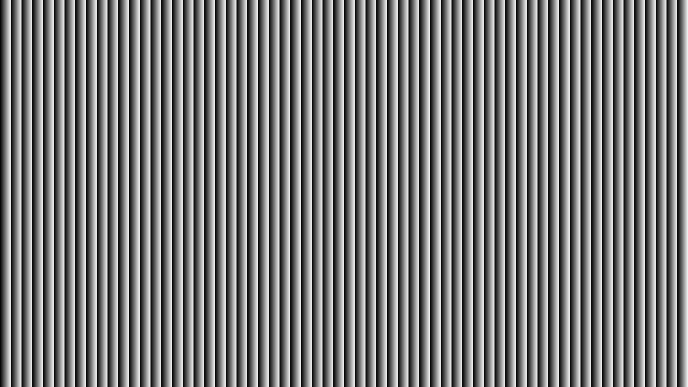
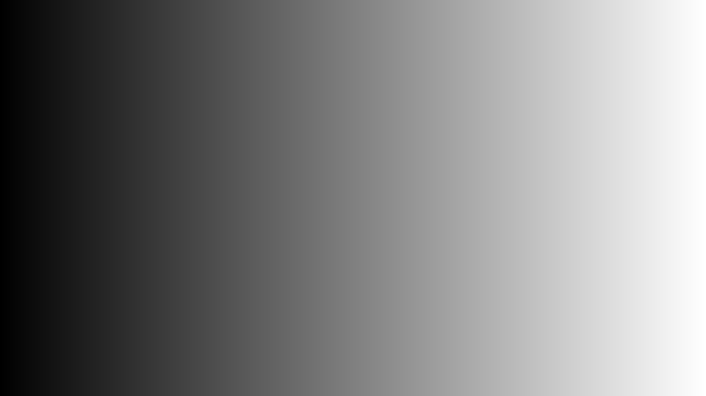

# Multi-Frequency Phase Shift 3D 복원

`src/StructuredLight/Core/MultiFrequencyPhaseShift.h` / `.cpp` 에 구현된, Gray Code +
다중 주파수 Phase Shifting Profilometry(PSP) 기반 3D 복원 파이프라인 설명서.
`python/MultiFrequencyPhaseShift.py` 를 Eigen 기반 C++로 포팅한 것이다.

예제 실행 파일: `example/MultiFrequencyTest.cpp` (`./build/MultiFrequencyTest dataset`)

---

## 1. 알고리즘 개요

프로젝터가 한 축(x) 방향으로 변하는 패턴을 투사하고, 카메라가 이를 촬영한다.
목표는 각 카메라 픽셀이 "프로젝터의 어느 x 좌표(`uProj ∈ [0,1)`)에 대응하는가"를
알아내는 것이다. 이 대응관계(correspondence)를 알면 카메라 레이와 프로젝터
평면의 교차점으로 3D 점을 삼각측량할 수 있다.

`uProj` 하나만으로 절대 좌표를 구하기는 어렵기 때문에, 두 가지 패턴을 함께 사용한다.

1. **Gray Code (coarse)** — `2^nGrayBits` 개의 큰 stripe로 화면을 분할하여
   "대략 몇 번째 stripe인가"를 알아낸다. 노이즈에 강하지만 해상도가 낮다.
2. **Multi-Frequency Phase Shift (fine)** — 여러 주파수의 사인파 패턴을 단계적으로
   투사하여 sub-pixel 정밀도의 위상(phase)을 얻는다. 정밀하지만 위상이
   `2π` 주기로 반복(wrap)되어 절대 위치를 알 수 없다.

두 정보를 **cascade unwrapping**으로 결합한다:
가장 낮은 주파수(`frequencies.front() == 2^nGrayBits`)는 Gray code 인덱스와
1:1로 대응되므로 절대 위상을 바로 알 수 있고, 그 다음 주파수부터는
이전 단계의 절대 위상을 carrier로 사용해 `2π`의 몇 배를 더해야 하는지(fringe order)를
결정한다. 이를 최고 주파수까지 반복하면 sub-pixel 정밀도의 절대 위상을 얻는다.

```
Gray code (coarse) ──┐
                      ├─▶ absPhase(f0) ──unwrap──▶ absPhase(f1) ──unwrap──▶ ... ──▶ absPhase(fN)
phase f0 (=2^nGrayBits) ─┘                                                         │
                                                                                     ▼
                                                              uProj = absPhase(fN) / (2π·fN)
```

마지막으로 `uProj`와 카메라/프로젝터 캘리브레이션을 이용해
**카메라 레이 ∩ 프로젝터 평면** 교차로 3D 점을 계산한다.

---

## 2. 입력 이미지

`example/MultiFrequencyTest.cpp`가 `dataset/`에서 읽어 `GrayCodeFrames` /
`PhaseFrequencyFrames`로 넘기는 카메라 캡처 이미지들이다. 모두 카메라 시점에서
촬영된 grayscale 이미지(`Image`, `ArrayXXf`)이며, 픽셀 단위로 직접 연산에
사용된다.

### 2.1 Gray Code 비트 평면 — `dataset/gray/render_0{0..3}.png`, `render_white/black.png`

`GrayCodeFrames::bitPlanes`(MSB first)와 명암 기준이 되는 `white`/`black`
레퍼런스. 흰 영역 = 해당 비트가 1인 stripe, 검은 영역 = 0인 stripe.

| bit 0 (MSB)                       | bit 3 (LSB)                       | white                               | black                               |
| --------------------------------- | --------------------------------- | ----------------------------------- | ----------------------------------- |
|  |  |  |  |

- bit이 낮아질수록(LSB에 가까울수록) stripe 폭이 좁아진다 — `nGrayBits=4`이면
  `2^4=16`개의 stripe로 화면이 분할된다.
- `white`/`black`은 `decodeGrayCode`의 이진화 임계값
  `(white+black)/2`와 유효성 판정(`(white-black) > grayModulationThreshold`)에 쓰인다.

### 2.2 주파수별 4-step Phase Shift 캡처 — `dataset/{16,32,64}/render_0{0..3}.png`

`PhaseFrequencyFrames`의 각 주파수(`f`)에 대해 4장씩 존재하는 사인파 패턴
캡처본. step `i`는 `cos(φ - 2π·i/4)` 위상으로 투사된 패턴이며, 4장을 조합해
`wrappedPhase`/`modulation`을 계산한다(3.2~3.3절 참고).

아래는 `f=64` (최고 주파수)의 4-step 예시이다:

| step 0                                 | step 1                                 | step 2                                 | step 3                                 |
| -------------------------------------- | -------------------------------------- | -------------------------------------- | -------------------------------------- |
|  |  |  |  |

- 화면을 가로지르는 사인파 줄무늬가 1/4 주기씩 옆으로 이동한 4장이다.
- 주파수가 높을수록(`f=64`) 줄무늬가 가늘고 촘촘하며, 낮을수록(`f=16`)
  굵고 듬성듬성하다 — `frequencies = {16, 32, 64}`는 화면에 각각
  16/32/64개의 사인파 주기가 들어가도록 투사된 패턴이다.
- `frequencies.front()`(=16)는 `2^nGrayBits`(=16)와 같아야 하며, 이 최저
  주파수의 1 주기가 Gray code의 1 stripe와 정확히 대응한다.

---

## 3. 파이프라인 단계별 디버그 이미지

`MultiFrequencyPhaseShift::ExportDebugFile(outputDir)` 를 호출하면 아래 중간 결과를
`outputDir/*.png` (8bit grayscale)로 저장한다. 아래 이미지들은
`dataset/` (1280x720) 실행 결과(`multi_freq_debug/`)이다.

### 3.1 Gray Code 디코딩 — `gray_index.png`

`gray.bitPlanes` (MSB first)를 `white`/`black` 레퍼런스의 픽셀별 중간값으로
이진화한 뒤 Gray code → binary 변환하여 stripe index `k`를 얻는다
(`detail::decodeGrayCode`). `medianKernelSize > 1`이면 3x3 median 필터로
고립된 디코딩 오류를 제거한다(`detail::median3`).

객체에 투영되어 카메라로 캡처된 결과(`gray_index.png`)는 객체 표면의 굴곡/원근
때문에 stripe 경계가 휘어 보인다. 같은 연산을 프로젝터가 그대로 내보내는
평면 패턴(`dataset/gray/pattern_0{0..3}.png`, `pattern_white/black.png`)에
적용하면, 어떤 변환이 일어나는지 왜곡 없이 확인할 수 있다.

| 평면 패턴 (`pattern_gray_index`)                    | 객체 투영 (`gray_index`)            |
| --------------------------------------------------- | ----------------------------------- |
|  |  |

- 평면 패턴 결과는 `2^nGrayBits = 16`개의 stripe가 0(검정) ~ 15(흰색)까지
  균일한 폭의 계단형 그라디언트로 정확히 나뉜다 — Gray code → binary 디코딩이
  "왼쪽에서 오른쪽으로 1씩 증가하는 stripe index"를 만들어낸다는 것을 보여주는
  이상적인(ideal) 결과다.
- 객체 투영 결과는 같은 16단 계단이 객체 표면의 형태를 따라 휘거나 일부
  구간이 좁아진 모습으로 나타난다. 줄무늬 경계에서 튀는 픽셀이 있으면
  `grayModulationThreshold`를 조정하거나 `medianKernelSize`를 키운다.

유효성: `(white - black) > grayModulationThreshold`. 명암 대비가 너무 약한
영역(배경, 그림자)은 무효 처리된다.

### 3.2 주파수별 Wrapped Phase — `wrapped_phase_{f}.png`

각 주파수 `f`에 대해 4-step PSP로 캡처한 이미지에서 wrapped phase를 계산한다
(`detail::wrappedPhase`):

```
a = I0 - I2 = 255·cos(φ)
b = I1 - I3 = 255·sin(φ)
φ = atan2(b, a)  (0 ~ 2π로 정규화)
```

같은 공식을 프로젝터가 내보내는 평면 패턴(`dataset/{f}/pattern_0{0..3}.png`)에
적용하면, 객체 굴곡 없이 "wrapped phase가 왜 0~2π로 반복되는 톱니파인지"를
바로 확인할 수 있다.

평면 패턴 (`pattern_wrapped_phase_{f}`):

| f = 16                                                    | f = 32                                                    | f = 64                                                    |
| --------------------------------------------------------- | --------------------------------------------------------- | --------------------------------------------------------- |
|  |  |  |

객체 투영 (`wrapped_phase_{f}`):

| f = 16                                    | f = 32                                    | f = 64                                    |
| ----------------------------------------- | ----------------------------------------- | ----------------------------------------- |
|  |  |  |

- 밝기 0~255가 위상 0~2π에 선형 대응한다.
- 평면 패턴 결과는 0(검정)→255(흰색)로 선형 증가하다가 다시 0으로 떨어지는
  세로 톱니(sawtooth) 줄무늬가 정확히 `f`개 반복된다(`f=16`→16개,
  `f=64`→64개). 이 반복 주기가 바로 "fringe order"의 모호성이다 —
  같은 밝기값이 화면 전체에서 `f`번 나타나므로, wrapped phase 한 장만으로는
  어느 주기에 속하는지 알 수 없다.
- 객체 투영 결과는 같은 톱니파가 객체 표면의 깊이 변화에 따라 가로 방향으로
  압축/팽창되어 보인다(표면이 가까울수록/멀수록 줄무늬 폭이 달라짐). 이
  변형량이 곧 깊이 정보이며, 3.4절의 unwrapping을 거쳐 절대 위상으로
  변환된다.

### 3.3 주파수별 Modulation — `modulation_{f}.png`

```
modulation = max(I0..I3) - min(I0..I3)
```

신호의 진폭(대비)을 나타내며, 최고 주파수의 modulation이
`phaseModulationThreshold`보다 큰 픽셀만 최종 결과에서 유효로 간주한다.

| f = 16                             | f = 32                             | f = 64                             |
| ---------------------------------- | ---------------------------------- | ---------------------------------- |
|  |  |  |

어두운 영역(투사광이 거의 닿지 않거나 카메라 시야 밖)은 modulation이 낮아
검게 표시되며, 이런 픽셀은 최종 포인트 클라우드에서 제외된다.

### 3.4 Cascade Unwrapping 결과 — `abs_phase.png`

```
absPhase(f0) = wrapped(f0) + 2π · grayIndex
absPhase(f_{i+1}) = unwrap(wrapped(f_{i+1}), absPhase(f_i), ratio = f_{i+1}/f_i)
```

`unwrapAgainstCarrier`는 `(carrier·ratio - fineWrapped) / 2π` 를 반올림하여
fringe order를 결정하고, `medianKernelSize`로 경계의 ±1 오차 전파를 억제한다.

평면 패턴의 `pattern_gray_index`(3.1절)와 `pattern_wrapped_phase_{16,32,64}`
(3.2절)를 동일한 cascade unwrapping에 입력하면, 객체 굴곡이 전혀 없는
이상적인 absPhase를 얻는다. 이를 객체 투영 결과(`abs_phase.png`)와 비교하면
unwrapping이 "반복되는 톱니파들을 어떻게 하나의 연속 그라디언트로 합치는지"를
직관적으로 볼 수 있다.

| 평면 패턴 (`pattern_abs_phase`)                   | 객체 투영 (`abs_phase`)           |
| ------------------------------------------------- | --------------------------------- |
|  |  |

- 평면 패턴 결과는 3.2절의 f=16/32/64 톱니 무늬가 모두 사라지고, 화면
  좌측(검정, absPhase≈0)에서 우측(흰색, absPhase≈2π·64)까지 완전히
  단조롭게 증가하는 단일 그라디언트가 된다 — 이것이 cascade unwrapping의
  "정답" 형태다.
- 객체 투영 결과는 같은 단일 그라디언트가 객체 표면의 깊이에 따라 휘어지거나
  압축/팽창된 형태로 나타난다. 이 변형이 곧 깊이 정보를 인코딩하고 있으며,
  3.7절의 삼각측량 입력이 된다.
- 객체 투영 결과에 평면 패턴에는 없던 톱니 줄무늬가 일부 남아 있다면
  cascade unwrapping이 실패(잘못된 fringe order 선택)한 것으로, Gray code
  디코딩 오류 또는 `medianKernelSize` 부족이 원인일 수 있다.

### 3.5 정규화 Projector 좌표 — `uproj.png`

```
uProj = absPhase(topFreq) / (2π · topFreq)   ∈ [0, 1)
```

| 평면 패턴 (`pattern_uproj`)               | 객체 투영 (`uproj`)       |
| ----------------------------------------- | ------------------------- |
|  |  |

- 평면 패턴 결과는 프로젝터의 x 좌표(0~1)에 정확히 선형으로 대응하는
  좌측(0, 검정)→우측(1, 흰색) 그라디언트다 — "이 카메라 픽셀이 프로젝터의
  어느 x 위치에서 온 빛을 보고 있는가"를 그대로 보여주는 최종 correspondence
  맵의 이상적인 형태다.
- 객체 투영 결과는 `abs_phase.png`와 거의 동일한 패턴이지만 최고 주파수로
  정규화되어 있으며, 객체 표면의 깊이에 따라 평면 패턴의 선형 그라디언트가
  휘어진 형태로 나타난다.

### 3.6 최종 유효성 마스크 — `valid.png`

```
valid = grayResult.valid && (modulation[topFreq] > phaseModulationThreshold)
```


- 흰색(255) = correspondence가 유효한 픽셀, 검은색(0) = 무효.
- 객체 윤곽과 잘 맞아야 한다. 배경이 흰색으로 남아 있다면
  `grayModulationThreshold`/`phaseModulationThreshold`를 높여야 한다.

### 3.7 삼각측량 결과 — `depth.png`, `triangulation_valid.png`

`CpuPlaneTriangulator::triangulate`가 카메라 레이와, `uProj`로 정의되는
프로젝터 평면(법선 `Rp2w · (-1, 0, slope)`)의 교차점을 계산한다.
`depth.png`는 결과 3D 점의 world Z 좌표를, `triangulation_valid.png`는
`valid && |denom| > eps && t > 0` 마스크를 시각화한다.

| depth (world Z)           | triangulation valid                         |
| ------------------------- | ------------------------------------------- |
|  |  |

- `depth.png`는 객체 표면의 굴곡에 따른 명암 변화로 표시된다(가까울수록/멀수록
  밝기 차이). 평면이어야 할 영역에 노이즈가 많다면 위상 unwrapping 오류나
  캘리브레이션 오차를 의심한다.
- `triangulation_valid.png`는 `valid.png`보다 더 좁아질 수 있다
  (교차각이 0에 가까운 픽셀, `t <= 0`인 픽셀이 추가로 제외됨).

---

### 3.7. 수식 정리

#### 변수 정의

$$

\begin{array}{c|c|l}
\text{기호} & \text{코드} & \text{의미} \\
\hline
(u, v) & (c, r) & \text{카메라 픽셀 좌표} \\

f_x, f_y, c_x, c_y
& \texttt{camera.intrinsic}
& \text{카메라 intrinsic 파라미터} \\

\mathbf{R}_{c \to w}
& \texttt{Rc2w}
& \text{카메라 좌표계} \to \text{world 좌표계 회전행렬 } (= I) \\

\mathbf{C}_{cam}
& \texttt{camCenter}
& \text{카메라 광학중심 } (= \mathbf{0}) \\

f_{xp}, c_{xp}, W_p
& \texttt{projector.intrinsic}, \texttt{imageSize}
& \text{프로젝터 intrinsic 및 프로젝터 이미지 너비} \\

u_{proj}
& \texttt{corr.uProj}
& \text{정규화된 프로젝터 } x \text{ 좌표 } \in [0, 1) \\

\mathbf{R}_{p \to w}
& \texttt{Rp2w}
& \text{프로젝터 좌표계} \to \text{world 좌표계 회전행렬} \\

\mathbf{C}_{proj}
& \texttt{projCenter}
& \text{world 좌표계 기준 프로젝터 광학중심}
\end{array}
$$

---

#### Step 1 — 카메라 레이

$$
\mathbf{d}_{cam}
=
\begin{bmatrix}
\dfrac{u - c_x}{f_x} \\
\dfrac{v - c_y}{f_y} \\
1
\end{bmatrix}
$$

$$
\mathbf{d}_{world}
=
\mathbf{R}_{c \to w}
\mathbf{d}_{cam}
$$

$$
\mathbf{P}(t)
=
\mathbf{C}_{cam}
+
t \mathbf{d}_{world}
$$

---

#### Step 2 — 프로젝터 수직 평면

$u_{proj}$ → 프로젝터 픽셀 x → 기울기 $a$:

$$
a = \frac{u_{proj} \cdot W_p - c_{xp}}{f_{xp}}
$$

프로젝터 좌표계에서 이 열(column)을 통과하는 수직 평면의 법선:

$$
\mathbf{n}_{proj} = \begin{bmatrix} -1,\ 0,\ a \end{bmatrix}
$$

유도: 프로젝터 핀홀 모델에서 x 열에 투영되는 점은 $X/Z = a$ 를 만족

$\Rightarrow X - aZ = 0 \Rightarrow \mathbf{n} = (-1,,0,,a)$

World 좌표계로 회전:

$$
\mathbf{n}_{world}
=
\mathbf{R}_{p \to w}
\cdot
\mathbf{n}_{proj}
=
\mathbf{R}_{p \to w}
\begin{bmatrix}
-1 \\
0 \\
a
\end{bmatrix}
$$

코드에서:

normalWorld = -Rp2w.col(0) + a \* Rp2w.col(2)

---

#### Step 3 — 레이-평면 교차

- 핵심 개념
  - 카메라 ray가 projector column plane에 교차하는 지점을 찾는 것
  - 그 수식이 $(Ray_{camera} - O_{projector}) \cdot n_{world} = 0$ 이다.

카메라 레이는 이렇게 쓸 수 있어.

$$ P={C}_{cam} +t \cdot {d}_{world}$$

- $\mathbf{C}_{cam}$ : 카메라 중심
- $\mathbf{d}_{world}$ : 카메라 픽셀에서 나가는 ray 방향
  $t$ : 카메라 중심에서 얼마나 멀리 가야 하는지 나타내는 스칼라

평면 방정식 (프로젝터 center $\mathbf{C}_{proj}$ 를 지남):

$$
(\mathbf{P} - \mathbf{C}_{proj}) \cdot \mathbf{n}_{world} = 0
$$

$$
\mathbf{P} = \mathbf{C}_{cam} + t\mathbf{d}_{world}
$$

$$
(\mathbf{C}_{cam} + t\mathbf{d}_{world} - \mathbf{C}_{proj})
\cdot \mathbf{n}_{world} = 0
$$

$$
(\mathbf{C}_{cam} - \mathbf{C}_{proj}) \cdot \mathbf{n}_{world}
+
t(\mathbf{d}_{world} \cdot \mathbf{n}_{world})
= 0
$$

$$
t =
\frac{
(\mathbf{C}_{proj} - \mathbf{C}_{cam}) \cdot \mathbf{n}_{world}
}{
\mathbf{d}_{world} \cdot \mathbf{n}_{world}
}
$$

$$
\boldsymbol{\delta}
=
\mathbf{C}_{proj} - \mathbf{C}_{cam}
$$

$$
t =
\frac{
\boldsymbol{\delta} \cdot \mathbf{n}_{world}
}{
\mathbf{d}_{world} \cdot \mathbf{n}_{world}
}
$$

$$
\boxed{
\mathbf{P}
=
\mathbf{C}_{cam}
+
t\mathbf{d}_{world}
}
$$

---

#### 유효성 조건

$$
|\mathbf{d}{world} \cdot \mathbf{n}{world}| > \varepsilon \quad \text{(레이가 평면에 평행하지 않음)}
$$

$$
t > 0 \quad \text{(교차점이 카메라 앞쪽)}
$$

카메라가 원점일 때 단순화
$\mathbf{C}{cam} = \mathbf{0}$, $\mathbf{R}{c \to w} = \mathbf{I}$ 이므로:

$$
t = \frac{\mathbf{C}{proj} \cdot \mathbf{n}{world}}{\mathbf{d}{cam} \cdot \mathbf{n}{world}}, \qquad \mathbf{P} = t,\mathbf{d}_{cam}
$$

결과 $\mathbf{P}$ 의 좌표계가 곧 카메라 좌표계 — $Z$ 값이 카메라로부터의 깊이(depth)가 된다.

---

## 4. 설정 (`MultiFreqConfig`)

| 필드                       | 기본값         | 설명                                                                   |
| -------------------------- | -------------- | ---------------------------------------------------------------------- |
| `nPhaseSteps`              | 4              | PSP step 수 (현재 구현은 4-step 고정)                                  |
| `nGrayBits`                | 4              | Gray code 비트 수. `frequencies.front()`는 `2^nGrayBits`와 같아야 한다 |
| `frequencies`              | `{16, 32, 64}` | 오름차순 위상 주파수 목록. cascade unwrapping 순서를 결정한다          |
| `grayModulationThreshold`  | 20.0           | `white - black` 최소 명암차. 미달 시 Gray code 무효                    |
| `phaseModulationThreshold` | 8.0            | 최고 주파수의 `max-min` 최소값. 미달 시 위상 무효                      |
| `medianKernelSize`         | 3              | Gray code 인덱스 및 fringe order의 3x3 median 필터 크기 (1이면 비활성) |

---

## 5. API 사용법

```cpp
#include "StructuredLight/Core/MultiFrequencyPhaseShift.h"

sl::MultiFreqConfig config;
config.nGrayBits   = 4;
config.frequencies = { 16, 32, 64 };  // frequencies.front() == 1 << nGrayBits

sl::MultiFrequencyPhaseShift reconstructor(config, cameraCalibration, projectorCalibration);

// gray: bitPlanes(MSB first) + white/black 레퍼런스
// freqFrames: 주파수별 4-step 캡처 이미지 (std::map<int, std::array<Image,4>>)
sl::ReconstructionResult result = reconstructor.run(gray, freqFrames);

sl::PointCloud points = result.toPointCloud();  // 유효 픽셀만 PointCloud로 변환

// 파이프라인 중간 결과를 PNG로 저장 (위 2장의 이미지들)
reconstructor.ExportDebugFile("multi_freq_debug");
```

- `computeProjectorCoordinate()` 만 호출하면 삼각측량 없이 `uProj`/`valid`까지만
  계산한다. `run()`은 내부적으로 이를 호출한 뒤 삼각측량까지 수행한다.
- `ExportDebugFile()`은 가장 최근에 호출한 `computeProjectorCoordinate()`/`run()`의
  중간 결과를 기록한다. 삼각측량 단계(`depth.png`, `triangulation_valid.png`)는
  `run()`을 호출한 경우에만 채워진다.

---

## 6. 확장 포인트 (Compute Shader 백엔드)

각 파이프라인 단계는 인터페이스로 분리되어 있어(Strategy + 의존성 주입),
동일 인터페이스를 구현하는 GPU 백엔드로 교체할 수 있다.

| 인터페이스         | 기본(CPU) 구현         | 역할                                |
| ------------------ | ---------------------- | ----------------------------------- |
| `IGrayCodeDecoder` | `CpuGrayCodeDecoder`   | Gray code → stripe index            |
| `IPhaseAnalyzer`   | `CpuPhaseAnalyzer`     | 4-step → wrapped phase / modulation |
| `IPhaseUnwrapper`  | `CpuCascadeUnwrapper`  | carrier 기반 fringe order 보정      |
| `ITriangulator`    | `CpuPlaneTriangulator` | 레이-평면 삼각측량                  |

`MultiFrequencyPhaseShift` 생성자에 `std::shared_ptr<I*>` 구현체를 주입하면
오케스트레이션 코드(`computeProjectorCoordinate`/`run`)는 변경 없이 GPU 경로로
교체된다.
